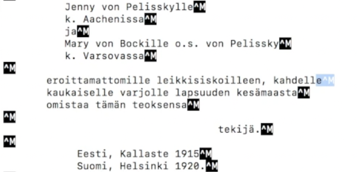
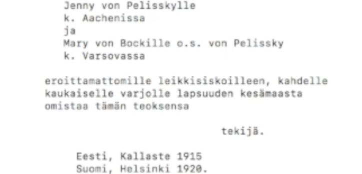

## Command Line Course for Linguists

### Introduction

This course was meant for linguistics and language technology students to learn how to use a command line interface for basic tasks such as the removal, editing and moving of files and directories, along with more elaborate tasks sensible to the students' study field such as text editing and corpus processing. 

Aside from command line terms, students learned a bit of Python language as well, and at the end of the course they created their own GitHub account to develop a website online. In fact, the final product of this course is this very website.

#### Week 1: Introduction to Command Line Environments

We got introduced to the command line environment, building confidence in using basic commands such as:
  * ls for listing contents of directories,
  * cd for moving across directories,
  * wget for downloading content from the internet,
  * mkdir and rmdir for respectively making and removing directories,
  * cp for copying and renaming files,
  * less for text displaying, and
  * emacs for text editing.

These felt like _a lot_ of new things to learn in one lesson, and I must admit I was mildly intimidated by it. However my interest for the subject was stronger than my fear to fail this course.

#### Week 2: Navigating a UNIX system

We learned more about how to apply commands such as cp and mv to respectively copy and move directories — or to rename them, as mv can be used for that purpose as well by not specifying the target directory, but instead moving the file/directory into a "new" one with a different name. This was the first week in which we had to turn a directory in for the assignment, which led us to learn how to compress directories into .tgz files with the command tar as follows. We also learned that the same can be done to files with the command gzip, but we didn't make use of that command all that much.

Another thing we learned was to use chmod to change read (r), write (w) or execute (x) permissions for user classes (u, such as file owners), group classes (g, such as a whole group owning the file) or others (o, none of the previously mentioned) in file, and to check for what permissions the user has with the command ls -l.

Lastly, we learned to form a remote connection to a server with ssh and exchanging files with it with scp. We trained this by connecting to [puhti](https://docs.csc.fi/computing/overview/)'s (one of CSC's supercomputer's) server.

#### Week 3: Basic Corpus Processing

This was a very interesting week, as we learned the difference between various character encodings, which encoding is used for whichever file with the file command, and how to switch to the encoding that works best with the command iconv as follows.

```
iconv -f [initial encoding name] -t [target encoding name] [filename]
```

Spoiler alert: the best encoding to analyse finnish text corpora is UTF-8.

We also learned to convert files from dos to unix with dos2unix and doing the opposite with unix2dos. Changing a file into unix converts its end of line from one with CRLF (carriage return line feed) terminator to a simple LF terminator. When viewing a text with less (a command that displays text files or command outputs) one can notice the difference between non-unix and unix format judging by the presence of a ^M symbol or lack thereof, as seen below.

| non-unix format                                                                  | unix format                                                                      |
| -------------------------------------------------------------------------------- |:--------------------------------------------------------------------------------:| 
|||

When a file is in unix, we are able to process it for corpus processing with the help of the commands:
  * tr for transforming characters into others (allowing us to change all uppercase letters into lowercase so that the same word is not considered two different words just because of case sensitivity)
  * sort to sort words in alphabetical, numerical or their opposites' orders
  * uniq for removing duplicate lines, ensuring that we have a word list with no repetitions

Although this was interesting, I felt as if I didn't yet learn enough to make good use of the commands I had just learned. Luckily, the following week was...

#### Week 4: Advanced corpus processing

This week we added to what we previously learned by introducing the command "sed" (stream editor), which allows the user to search lines that match a certain pattern, move and/or delete said lines.

With sed's different features we were able to process a text file line per line, count the number of lines that matched a certain string and even transform a file into a list of n-grams. So instead of processing a corpus on a word-by-word scale we were able to process it sentence-per-sentence (after editing the text file with tr to display one sentence per line).

To be able to apply several changes to the same file without producing new files in between commands, we also learned to concatenate commands by adding a "|" in between them and writing them all on the same row.

After this week I had the feeling that I finally had learned enough to present concrete examples whenever people asked me what the command line course was teaching me.

### Week 5: 

In the previous week we learned about the concatenation of files. This week we learned on how to spare _even more_ time by putting all concatenated commands into a script and executing the script on a file instead of having to write each command in order every time. i.e. instead of having to write the following command

```
cat [filename] | dos2unix -f | tr -s "[:space:]" "\n" | tr -d "[:punct:]" | sort | uniq -c | sort -nr > [freqlist_filename]
```

we put it into a .sh script file called freqlist.sh as follows

```
#! /bin/bash
cat $1 |
dos2unix -f |
tr -s "[:space:]" "\n" |
tr -d "[:punct:]" |
sort |
uniq -c |
sort -nr > $2
```

and execute it with the command

```
freqlist.sh $1 $2
```

Where $1 is replaced with the name of the file we want to process, and $2 is the name we want to give to the file that is the end result of the processing.

To ensure that the script runs only whenever the user inputs $1 and $2, we added an if-statement between the first line and the rest of the script.

An if-statement specifies that a block of command be executed if and only if certain conditions are met. i.e. the statement I added to the previously-mentioned script is the following

```
if [ $# -ne 2 ]
then
  echo "ERROR: two command line arguments required!"
  echo "$0 input_text_file output_freq_file"
  exit 1
fi
```

The statement can be translated line-per-line as follows

```
if the number of given arguments is not 2
then
print "ERROR: two command line arguments required!
print "$0 input_text_file output_freq_file"
exit the script with a value of 1 (which means the script did not work; if it did, the value should have been 0)
end of if statement
```

In addition to this, we got to learn how to change our command line environment preferences by editing either our .bashrc or .bash_profile files to i.e. change the colour of the shell, or to create aliases. The latter were the one that interested me the most, as using an alias saves time when having to write long urls such as the puhti server url. i.e. I added the alias puhti so that I would have to only write "puhti" to connect to the remote server. To do so I added the following line to my .bash_profile file:

```
alias puhti= "ssh puhti.csc.fi"
```

My favourite part of this week was to write scripts, as editing a script file is easier than to fix one's command line: this is because I put each command on one line of the script and was able to pinpoint potential mistakes easily by editing the script line-by-line.

#### Week 6: Installing and running programs

This week's title is self-explanatory. We installed programs using sudo and/or brew (both require to be followed by the command "install"). We installed Python3 and pip3 and learned to install Python packages with the latter (I unfortunately was unable to do so due to some incompatibility with my computer chip, but at least I know the installation process in theory) and to make Makefiles and run them.

A Makefile is a file that is able to run several scripts on several files and is called with the command "make". We made use of this feature by creating a Makefile that parses several text files simultaneously and generates a frequency list for each of them separately. The frequency lists were put in a directory apart from the one containing the initial data.

The reason why Makefiles are useful is that they save time (not having to execute the same script individually for each file) and have a smaller margin of error due to automatisation.

#### Week 7: Version Control

This week we learned to use GitHub. We installed git and made a remote repository on GitHub, which we cloned onto our own computers with "git clone [repository_url]" and started working with.

Onto the repository in question, we added the directory we worked with on the previous week with "git add [filename]", committed the change we applied with "git commit -m '[commit message]'" and pushed it onto the remote repository with "git push" so that the repository online is the same as the one on the computer. We also learned to create a branch with "git checkout -b [branchname]" and switch in between branches with "git checkout [branchname]" so as to work on a separate branch and commit changes without accidentally doing fatal damage to the main branch. After this we learned to merge branches into the main branch.

Since errors happen regardless of how much we prepare for them, we also learned about potential mistakes we may make when committing changes with git, and how to undo them. Said issues include making typos on the commit message, accidentally committing features on the main branch instead of a feature branch and redoing reset local changes.

#### Week 8: Final Assignment

For the final assignment we installed jekyll onto our computers and downloaded different webpage templates to work with. We were required to choose a template to work with and create a repository to create a Github Webpage. The end result of this assignment is this webpage you are reading at the moment. In addition to this, we also learned to format text on html and work on Overleaf to create a CV to attach to this webpage.

I think this was the most interesting week in the course, as I think it got me to undestand I did in fact learn _a lot_ on this course, or at least enough to create a (hopefully) fully working webpage.