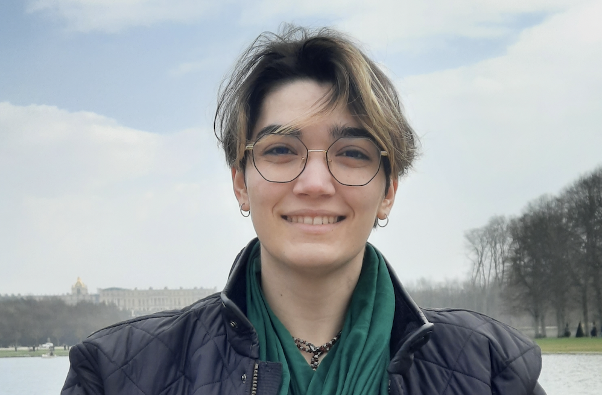

## Introduction

 I am a second year student at University of Helsinki, majoring in linguistics and studying for a minor degree in computer science. Learning languages has been my passion ever since I was a child, and realising I am not particularly interested in the philology of one single language, I decided to apply for a major degree in general linguistics.

On my first year in university I discovered the field of language technology, which has further fed my interest in coding and has led me to seek a minor degree in computer science.

My hobbies include reading, playing violin and playing videogames. I do enjoy physical activities as well, such as taking walks and occasionally skateboarding (or at least pretending to do the latter — I am still an amateur and like cruising around more than risking my life on the half-pipe)

## Find me on

[GitHub](https://github.com/ciccmin)

## Contact

e-mail: minerva.ciccarese@helsinki.fi. 

## Courses I've Taken

# Linguistics Courses

[Introduction to General Linguistics and Phonetics](https://studies.helsinki.fi/courses/cu/hy-CU-118591680-2021-08-01/KIK-401/Introduction_to_General_Linguistics_and_Phonetics), fall 2021

[Introduction to Comparative Literature](https://studies.helsinki.fi/courses/cu/hy-CU-118018492-2021-08-01), fall 2021

[Introduction to Language Technology](https://studies.helsinki.fi/courses/cu/hy-CU-118591924-2021-08-01/KIK-405/Introduction_to_Language_Technology), fall 2021

[Phonetics and Phonology](https://studies.helsinki.fi/courses/cu/hy-CU-117877928-2021-08-01/KIK-LG101/Phonetics_and_Phonology), fall 2021

[Morphology and Syntax](https://studies.helsinki.fi/courses/cur/hy-opt-cur-2223-61a8ba21-64cc-4f23-912a-3b1da473dc6f), spring 2022

[Introduction to Digital Humanities](https://studies.helsinki.fi/courses/cu/hy-CU-134491907-2021-08-01), spring 2022

[Language in Society and Culture](https://studies.helsinki.fi/courses/cu/hy-CU-118591802-2021-08-01/KIK-402/Language_in_Society_and_Culture), spring 2022

[Semantics and Pragmatics](https://studies.helsinki.fi/courses/cu/hy-CU-117877915-2021-08-01/KIK-LG103/Semantics_and_Pragmatics), spring 2022

[Command Line Tools for Linguists](https://studies.helsinki.fi/courses/cu/hy-CU-134651633-2021-08-01/KIK-LG221/Command_Line_Tools_for_Linguists), fall 2022

[Corpus Linguistics and Statistical Methods](https://studies.helsinki.fi/courses/cu/hy-CU-118591838-2021-08-01), fall 2022

# Computer Science Courses

[Introduction to Programming](https://studies.helsinki.fi/courses/cu/hy-CU-118023867-2021-08-01/TKT10002/Introduction_to_Programming), fall 2022

# Language Centre Courses

[Japanese for Beginners 1 through Blended Learning](https://studies.helsinki.fi/courses/cu/hy-CU-133160897-2022-08-01/KK-JAP002/Japanese_for_Beginners_1_through_Blended_Learning), fall 2021

[Japanese for Begiiners 2 through Blended Learning](https://studies.helsinki.fi/courses/cu/hy-CU-133160934-2021-08-01/KK-JAP101/Japanese_for_Beginners_2_through_Blended_Learning_CEFR_A1_), spring 2022

# Mandatory-for-all Courses

[Orientation Studies](https://studies.helsinki.fi/courses/cu/hy-CU-118010544-2021-08-01/HUM-001/Orientation_Studies), fall 2021

[Student's Digital Skills: Orientation](https://studies.helsinki.fi/courses/cu/hy-CU-134743242-2020-08-01/DIGI-A/Student_s_digital_skills_orientation), fall 2021

[Student's Digital Skills: Advanced Skills](https://studies.helsinki.fi/courses/cu/hy-CU-134743553-2020-08-01/DIGI-B/Student_s_digital_skills_advanced_skills), fall 2022

## Projects

# [cmdline-course](https://github.com/ciccmin/cmdline-course.git), fall 2022

A small project for the Command Line Tools for Linguists course, where various classical books are parsed to determine each book's word frequencies.

# [ciccmin.github.io](https://github.com/ciccmin/ciccmin.github.io), fall 2022

This website, also developed for the Command Line Tools for Linguists course. It gives the visitors a glimpse of my work and academic life.

## Misc. 

I have nothing of mine that I would particularly like to show, besides my [instagram account](https://www.instagram.com/ciccmin), perhaps.

If you want to see something cooler, have a [skating cat](https://www.youtube.com/watch?v=vYyUb_MI7to).
